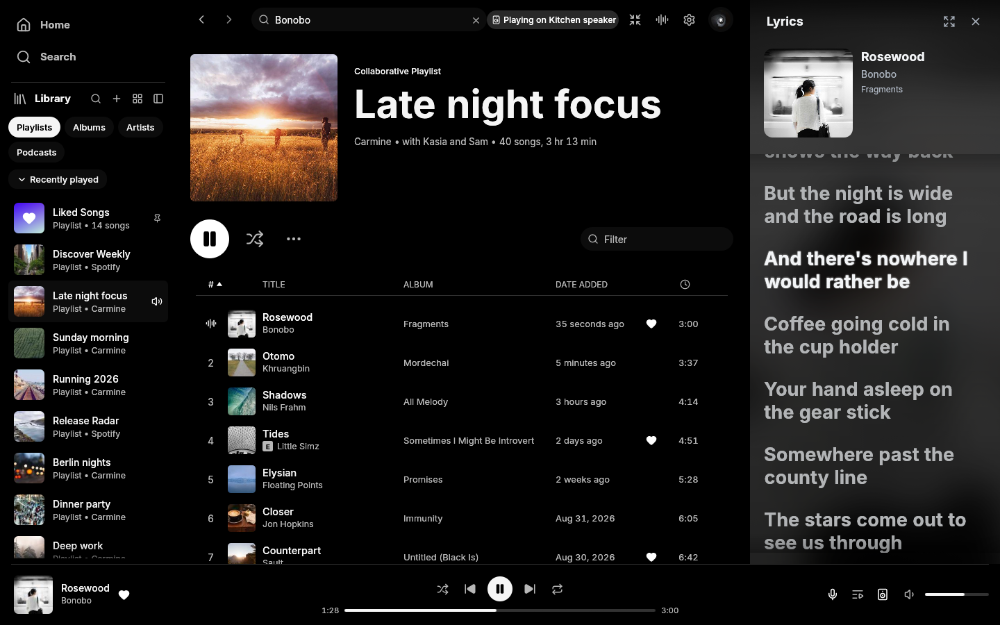

# MagicSpot

MagicSpot is a small [Spotifast](https://github.com/crmne/spotifast) fork focused on readable lyrics and themes. It was forked to give lyrics more room, with adjustable typography, artwork backgrounds and a neutral OLED appearance. Spotify playback follows upstream.

**[Download MagicSpot 2.0.1](https://github.com/FallenG101/MagicSpot2/releases/tag/v2.0.1)**

- **Windows x64:** open the standalone `.exe`. No installer or archive extraction is needed. License notices are included as a separate text download.
- **macOS, Apple Silicon and Intel:** open the universal `.dmg` and drag MagicSpot into Applications.

Windows is unsigned. The Mac app is ad-hoc signed without notarization and may need first-launch approval in Privacy & Security. Local playback requires Spotify Premium. Updates use manual downloads. MagicSpot supports Windows and macOS. Inherited Linux source is best effort without maintained builds.

## Lyrics and themes

- Spacious lyrics with a growing cover card, smooth following and timing that keeps up with rapid lines. Scroll to read ahead, press Follow to return, or click a timed line to seek.
- Saved Inter, System or Monospace fonts, an 18–48 point size or Auto, and switches for the active-line glow and artwork background.
- OLED with black surfaces and white/gray controls. Existing OLED Blue preferences carry over.
- Interrupted library loading offers Retry while keeping loaded playlists visible.

[Lyrics controls](docs/_guide/lyrics-and-themes.md) · [Install and build](docs/_guide/getting-started.md) · [Release notes](packaging/release-notes/v2.0.1.md) · [Validation](docs/magicspot/STATUS.md) · [Contribute](CONTRIBUTING.md)

## Upstream and licenses

Based on Spotifast by Carmine Paolino and contributors, with reviewed upstream updates through October 10, 2026. [Provenance and local patches](UPSTREAM.md) record the integration. Thanks to fastframe, librespot, egui, projectM, Inter, Noto Emoji and Lucide. Original copyright and license notices are retained in the repository and downloads.

Licensed under [MIT](LICENSE); dependencies and assets retain their own licenses. MagicSpot is independent of Spotify. Spotify is a trademark of Spotify AB.
