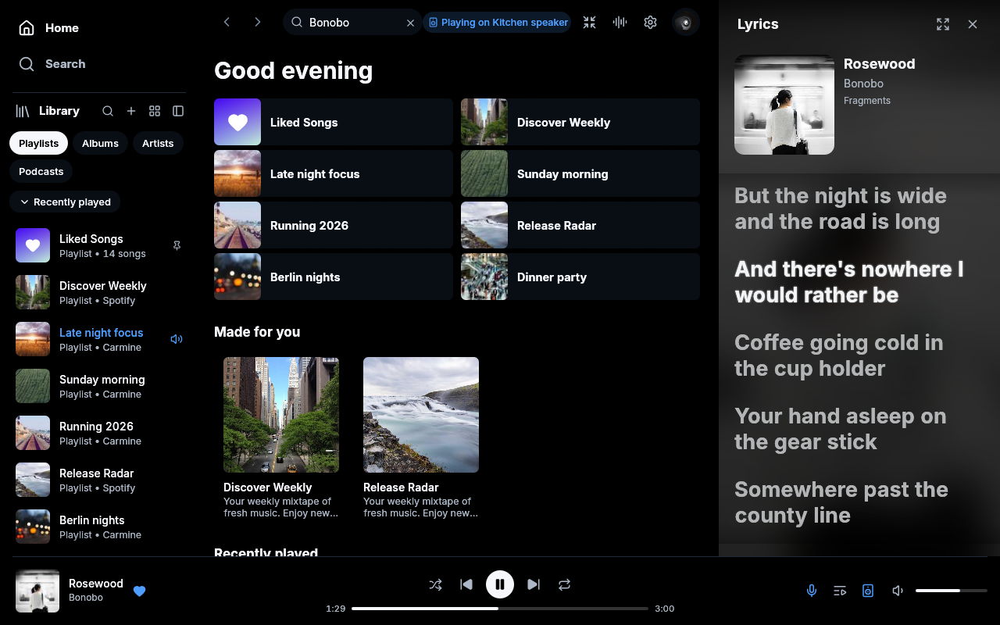

# MagicSpot 2.0

A native Spotify desktop app based on the latest [Spotifast](https://github.com/crmne/spotifast) foundation, with an Apple Music-inspired lyrics sidebar and OLED Blue.

**[Download MagicSpot for Windows and macOS](https://github.com/FallenG101/MagicSpot2/releases/tag/v2.0.0-preview.1).** On Windows, extract the ZIP and open `magicspot2.exe`. On macOS, open the universal DMG and drag MagicSpot to Applications. These are normal apps with Spotify sign-in and playback. Local playback requires Spotify Premium.

## What's new

- Bold, spacious lyrics with a larger song card, a subtle glow on the current line, smooth following and soft scroll edges. The sidebar background follows the album artwork. Scroll manually to read ahead, press Follow to return, or click a timed line to seek.
- **Settings > Appearance** offers Inter, System and Monospace lyrics fonts, plus switches for the glow and artwork background. These choices are saved.
- **Settings > Appearance > Theme > OLED Blue** selects black main surfaces and blue accents. Your choice is saved.
- A separate MagicSpot 2 profile, secure-store identity and updater. Sign in afresh; Spotifast and discontinued MagicSpot v3 settings and credentials are not imported.



The first release is `2.0.0-preview.1` for Windows x64 and macOS (Apple Silicon and Intel). It omits MilkDrop. Windows is unsigned; macOS is ad-hoc signed without notarization and may need approval in System Settings > Privacy & Security on first launch. Linux remains a source/CI target. Live Spotify account sign-in/playback and Connect have not been exercised in this development session; the inherited flows remain enabled. See the [release notes](packaging/release-notes/v2.0.0-preview.1.md) and [validation status](docs/magicspot/STATUS.md).

## Build and preview

Rust 1.98 is pinned. Build the normal application:

```sh
cargo build --locked --release --no-default-features
```

The executable is `target/release/magicspot2.exe` on Windows, or `target/release/magicspot2` elsewhere. The internal Rust library remains named `spotifast` to keep upstream integration small.

To preview the UI with sample data:

```sh
cargo run --locked --release --no-default-features --features demo -- --demo --demo-show lyrics,oled
```

Downloads are packaged with `packaging/magicspot/package-windows.ps1` and `packaging/magicspot/package-macos.sh`. The inherited Spotifast installer, release and package-publishing workflows remain disabled for this fork.

## Guides and provenance

The [Spotifast guide](https://spotifast.rocks/getting-started/) explains the inherited Spotify sign-in, local playback, Connect and personal-app flows. Its download links, app paths and performance figures refer to Spotifast. MagicSpot uses the same public Web API client and OAuth loopback behavior; it does not invent a new Spotify Client ID.

Read [identity and privacy](docs/magicspot/IDENTITY.md), [UI notes](docs/magicspot/UI_NOTES.md), [upstream provenance](UPSTREAM.md), and the [untouched baseline](docs/magicspot/BASELINE.md). MagicSpot v3 remains in its [discontinued repository](https://github.com/FallenG101/MagicSpot).

## Acknowledgements

MagicSpot is a fork of Spotifast by Carmine Paolino and contributors. It uses [fastframe](https://github.com/crmne/fastframe), [librespot](https://github.com/librespot-org/librespot), [egui](https://github.com/emilk/egui), [Inter](https://rsms.me/inter/) (OFL), [Noto Emoji](https://github.com/googlefonts/noto-emoji) (OFL), and [Lucide](https://lucide.dev) icons (ISC). Original license and copyright notices are retained and included in the download.

MagicSpot is independent and not affiliated with Spotify. Spotify is a trademark of Spotify AB. Licensed under the [MIT License](LICENSE).
